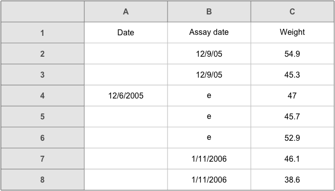
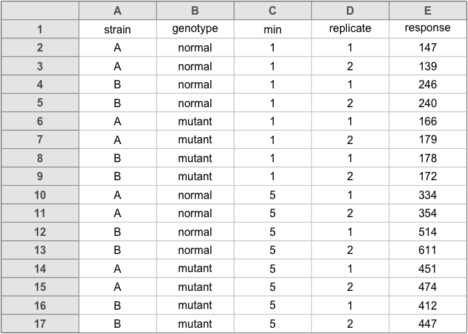
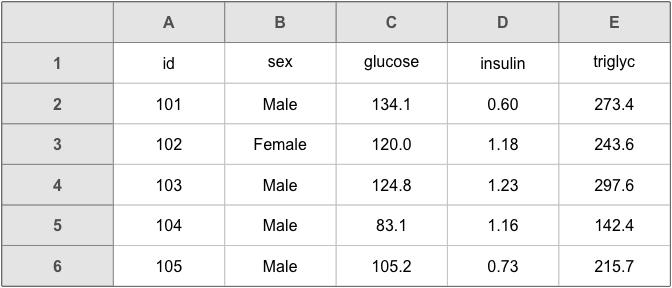
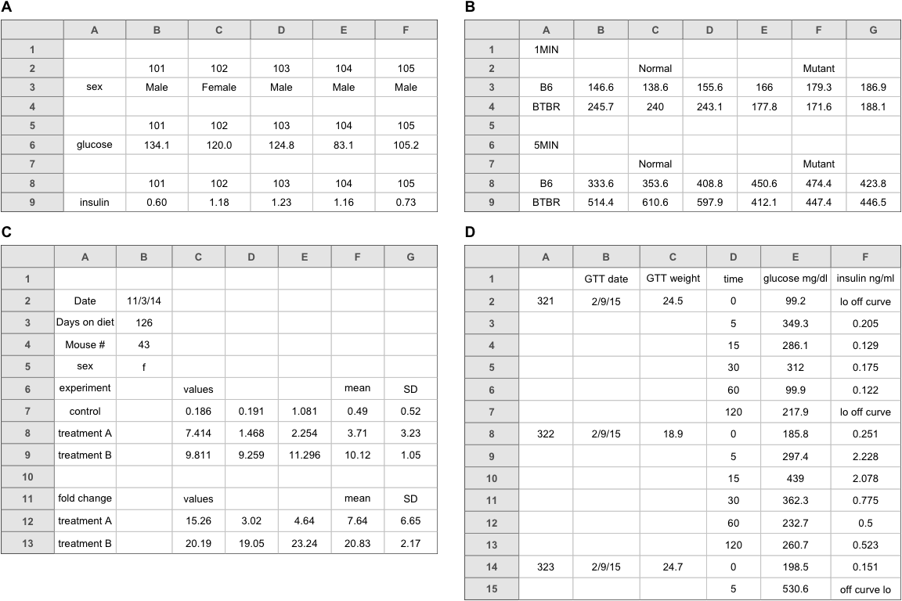
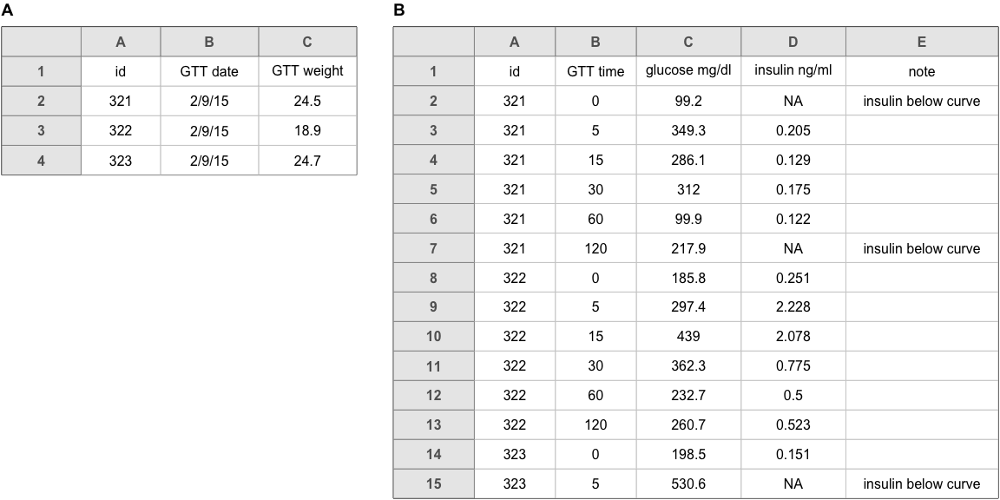
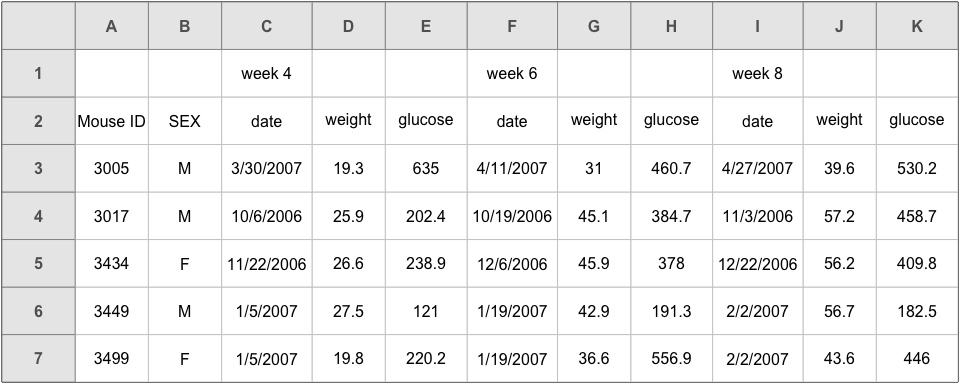
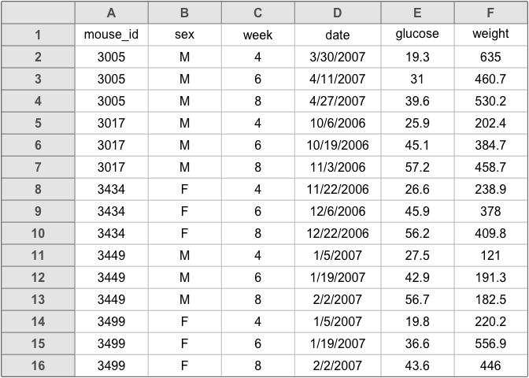
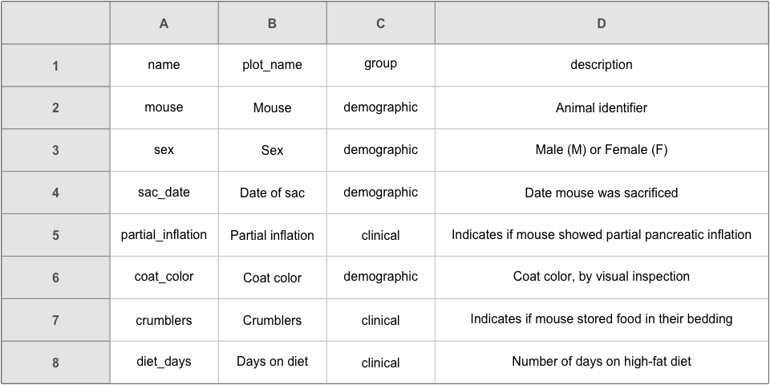
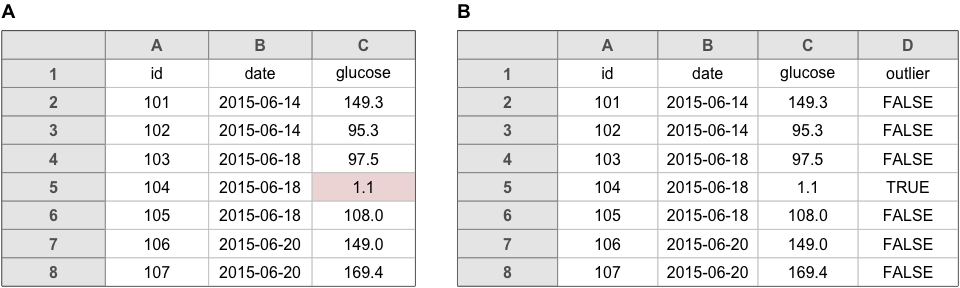
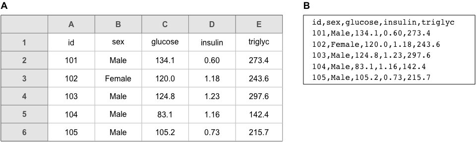

# Data organization in spreadsheets

## Introduction

Spreadsheets, for all of their mundane rectangularness, have been the subject of
angst and controversy for decades. Some writers have admonished that "real
programmers don't use spreadsheets" and that we must "stop that subversive
spreadsheet" [@casimir1992; @chadwick2003]. Others have advised researchers on
how to use spreadsheets to improve their productivity [@wagner2006]. Amid this
debate, spreadsheets have continued to play a significant role in researchers'
workflows, and it is clear that they are a valuable tool that researchers are
unlikely to abandon completely.

The dangers of spreadsheets are real, however -- so much so that the European
Spreadsheet Risks Interest Group keeps a public archive of spreadsheet "horror
stories" (<http://www.eusprig.org/horror-stories.htm>). Many researchers have examined error rates in
spreadsheets, and Panko [-@panko2008] reported that in 13 audits of real-world
spreadsheets, an average of 88% contained errors. Popular spreadsheet programs
also make certain types of errors easy to commit and difficult to rectify.
Microsoft Excel converts some gene names to dates and stores dates differently
between operating systems, which can cause problems in downstream analyses
[@zeeberg2004; @woo2014]. Researchers who use spreadsheets should be aware of
these common errors and design spreadsheets that are tidy, consistent, and as
resistant to mistakes as possible.

Spreadsheets are often used as a multipurpose tool for data entry, storage,
analysis, and visualization. Most spreadsheet programs allow users to perform
all of these tasks, however we believe that spreadsheets are best suited to data
entry and storage, and that analysis and visualization should happen separately.
Analyzing and visualizing data in a separate program, or at least in a
separate copy of the data file, reduces the risk of
contaminating or destroying the raw data in the spreadsheet.

Murrell [-@murrell2013] contrasts data that are formatted for humans to
view by eye with data that are formatted for a computer. He provides an
extended example of computer code to extract data from a set of files
with complex arrangements. It is important that data analysts be able
to work with such complex data files. But if the initial arrangement
of the data files is planned with the computer in mind, this would
simplify the later analysis process.

In this paper we offer practical recommendations for organizing spreadsheet data
in a way that both humans and computer programs can read. By following this
advice, researchers will create spreadsheets that are less error-prone, easier
for computers to process, and easier to share with collaborators and the public.
Spreadsheets that adhere to our recommendations will interface easily with the
tidy tools and reproducible methods described elsewhere in this collection and
will form the basis of a robust and reproducible analytic workflow.

For an existing dataset whose arrangement could be improved, we
recommend against applying tedious and potentially error-prone
hand-editing to revise the arrangement. Rather, we hope that the
reader might apply these principles when designing the layout for
future datasets.

## Be consistent

The first rule of data organization is *be consistent*. Whatever you do, do it
consistently. Entering and organizing your data in a consistent way from the
start will prevent you and your collaborators from having to spend time
harmonizing the data later.

_Use consistent codes for categorical variables._ For a
categorical variable like the sex of a mouse in a genetics study, use a single common value for
males (e.g. "`male`") and a single common value for females
(e.g. "`female`"). Don't sometimes write "`M`", sometimes "`male`",
and sometimes "`Male`". Pick one and stick to it.

_Use a consistent fixed code for any missing values._ We prefer to have
every cell filled in,
so that one can distinguish between
truly missing values and unintentionally missing
values. R users prefer "`NA`". You
could also use a hyphen. But stick with a single value
throughout your data. Definitely don't use a numeric value like
`-999` or `999`; it is easy to miss that it is intended to be
missing. Also, don't insert a note in place of the data,
explaining why it is missing. Rather, make a separate column with
such notes.

_Use consistent variable names._ If in one file (say the first
batch of subjects), you have a variable called "`Glucose_10wk`",
then call it exactly that in other files (say for other batches of
subjects). If it is variably called "`Glucose_10wk`",
"`gluc_10weeks`", and "`10 week glucose`", then downstream the
data analyst will have to work out that these are all really the
same thing.

_Use consistent subject identifiers._ If sometimes it is "`153`" and
sometimes "`mouse153`" and sometimes "`mouse-153F`" and sometimes
"`Mouse153`", there is going to be extra work to figure out who is
who.

_Use a consistent data layout in multiple files._ If your data are in multiple files
and you use different layouts in different files, it will be extra work for the
analyst to combine the files into one dataset for analysis. With a consistent
structure, it will be easy to automate this process.

_Use consistent file names._ Have some system for naming files. If one file is
called "`Serum_batch1_2015-01-30.csv`", then don't call the file for the next
batch "`batch2_serum_52915.csv`" but rather use "`Serum_batch2_2015-05-29.csv`".
Keeping a consistent file naming scheme will help ensure that your files remain
well organized, and it will make it easier to batch process the files if you
need to.

_Use a consistent format for all dates,_ preferably with the standard
format `YYYY-MM-DD`, for example `2015-08-01`. If sometimes you write `8/1/2015`
and sometimes `8-1-15`, it will be more difficult to use the dates in
analyses or data visualizations.

_Use consistent phrases in your notes._ If you have a separate
column of notes (for example, "`dead`" or "`lo off curve`"), be
consistent in what you write. Don't sometimes write "`dead`" and
sometimes "`Dead`", or sometimes "`lo off curve`" and sometimes
"`off curve lo`".

_Be careful about extra spaces within
cells._ A blank cell is different than a cell that contains a single space. And
"`male`" is different from "` male `" (that is, with spaces at the beginning and
end).

## Choose good names for things

It is important to pick good names for things. This can be
hard, and so it is worth putting some time and thought into it.

As a general rule, don't use spaces, either in variable names (that
is, the names of the columns in your data) or in
file names. They make programming harder: the analyst will need to
surround everything in double quotes, like `"glucose 6 weeks"`, rather
than just writing `glucose_6_weeks`. Where you might use spaces, use
underscores or perhaps hyphens. But don't use a mixture of underscores
and hyphens; pick one and be consistent.

Be careful about extraneous spaces (say, at the beginning or end of a
variable name). "`glucose`" is different from "`glucose `" (with an
extra space at the end).

Avoid special characters, too. (Except for underscores and hyphens;
they are okay.) Other symbols (`$`, `@`, `%`, `#`, `&`, `*`, `(`, `)`,
`!`, `/`, etc.) often have special meaning in programming languages, and so
they can be harder to handle.  They are also a bit harder to type.

The main principle in choosing names, whether for variables or for
file names, is *short, but meaningful*. So not *too* short.

The Data Carpentry
lesson on using spreadsheets (see <http://www.datacarpentry.org/spreadsheet-ecology-lesson/02-common-mistakes>)
has a nice table with good and bad example variable names:

**good name**       | **good alternative** | **avoid**
------------------- | -------------------- | ---------
`Max_temp_C`        | `MaxTemp`            | `Maximum Temp ($^{\circ}$C)`
`Precipitation_mm`  | `Precipitation`      | `precmm`
`Mean_year_growth`  | `MeanYearGrowth`     | `Mean growth/year`
`sex`               | `sex`                | `M/F`
`weight`            | `weight`             | `w.`
`cell_type`         | `CellType`           | `Cell type`
`Observation_01`    | `first_observation`  | `1st Obs.`

We agree with all of this, though we would maybe cut down on some of the
capitalization. So maybe `max_temp`, `precipitation`, and `mean_year_growth`.

Finally, never include "`final`" in a file name. You will invariably end up
with "`final_ver2`". (We can't say that without referring to the
widely-cited PhD comic, <http://bit.ly/phdcom_final>.)

## Write dates like YYYY-MM-DD

When entering dates, we strongly recommend using the global
"ISO 8601" standard, `YYYY-MM-DD`, such as `2013-02-27`. (See the related xkcd
comic, <https://xkcd.com/1179>.)

But note that Microsoft Excel does bizarre things with dates
(see <https://storify.com/kara_woo/excel-date-system-fiasco>). It stores them
internally as a number, counting the days since 1900-01-01. Wait, that is only
for Windows; on Macs, it counts the days since 1904-01-01. So, you may
need to manually check that the dates haven't been mangled when your data
come out of Excel.

Excel also has a tendency to turn other things into dates. For
example, Roger Peng reported on a conversation between Kasper Hansen
and Jeff Leek (<http://bit.ly/twitter_oct4a>,
<http://bit.ly/twitter_oct4b>):

> Kasper: _Do you have a favorite transcription factor?_
>
> Jeff: _Yes, Oct-4_
>
> Kasper: _?_
>
> Jeff: _Oct-4: because Excel turns it into a date and it actually has
> a cool function._

On this point, Ziemann et al. [-@ziemann2016] studied gene lists contained within the
supplementary files from 18 journals for the years 2005-2015, and
found that ~20% of gene lists had errors in the gene names, related to
the conversion of gene symbols to dates or floating-point numbers.

We often prefer to use a plain text format for columns in an Excel worksheet
that are going to contain dates, so that it doesn't do anything to them:

- Select the column
- In the menu bar, select Format → Cells
- Choose "Text" on the left

However, if you do this on columns that _already_ contain dates, Excel will
convert them to a text value of their underlying numeric representation (i.e.
days since 1900-01-01 or 1904-01-01).

Another way to force Excel to treat dates as text is to begin the date with an
apostrophe, like this: `'2014-06-14`
(see <http://bit.ly/twitter_apos>). Excel will treat the
cells as text, but the apostrophe will not appear when you view the spreadsheet
or export it to other formats. This is a handy trick, but it requires impeccable
diligence and consistency.

Alternatively, you could
create three separate columns
with year, month, and day. Those will be ordinary numbers, and so
Excel won't mess them up.

But the point we most want to emphasize here: be consistent in the way
in which you write dates. And really, always use the `YYYY-MM-DD`
format (or
put the year, month, and day in separate columns, if you want).

Figure 1 displays a portion of a spreadsheet that we got from a
collaborator. We don't quite remember what those e's were for, but in
any case having
different date formats within a column makes it more difficult to use
the dates in later analyses or data visualizations.

Use care about dates, and be consistent.

## No empty cells

Fill in all cells. Use some common code for missing data.
Not everyone agrees with us on this point (for example, White et al. [-@white2013]
state a preference for leaving cells blank), but we would prefer to have
"`NA`" or even a hyphen in the cells with missing data, to make
it clear that the data are known to be missing rather than
unintentionally left blank.

Figure 2 contains two examples of spreadsheets with some empty cells. In Figure
2A, cells were left blank when a single value was meant to be repeated multiple
times. Please don't do this! It is additional work for the analyst to determine
the implicit values for these cells. Moreover, if the rows are sorted at some
point there may be no way to recover the dates that belong in the empty cells.

The spreadsheet in Figure 2B has a complex layout with information for
different treatments.
It is perhaps clear that columns B-E all concern
the "1 min" treatment, and columns F-I all concern "5 min", and
that columns B, C, F, and G all concern "normal", while
columns D, E, H, and I concern "mutant". But while it may be easy to
see by eye, it can be hard to deal with this in later analyses.

You could fill in some of those cells, to make it more clear.
Alternatively, make a "tidy" version of the data [@wickham2014],
with each row being one replicate and with the response values all in one column, as in
Figure 3. We will discuss this further, below.

## Put just one thing in a cell

The cells in your spreadsheet should each contain one piece of
data. Don't put more than one thing in a cell.

For example, you might have a column with "`plate position`" as
"`plate-well`", such as "`13-A01`". It would be better to separate this
into "`plate`" and "`well`" columns (containing "`13`" and "`A01`"), or even
"`plate`", "`well_row`", and "`well_column`" (containing "`13`", "`A`",
and "`1`").

Or you might be tempted to include units, such as "`45 g`". It is better to
write `45` and put the units in the column name, such as
`body_weight_g`. It is even better to leave the column as `body_weight` and
put the units in a separate data dictionary (see below).

Another common situation is to include a note within a cell, with the
data, like "`0 (below threshold)`". Instead, write "`0`" and include a
separate column with such notes.

Finally, don't merge cells. It might look pretty, but you end up
breaking the rule of _no empty cells_.

## Make it a rectangle

The best layout for your data within a spreadsheet is as a single big
rectangle with rows corresponding to subjects and columns corresponding to
variables. The first row should contain variable names.
(*Please don't use more than one row for the variable names.*)
An example of a rectangular layout is shown in Figure 4.

Some datasets won't fit nicely into a single rectangle, but they will usually
fit into a set of rectangles, in which case you can make a set of Excel files,
each with a rectangle of data. It is best to keep each rectangle in its own
file; tables scattered around a worksheet are difficult to work with, and they
make it hard to export the data to CSV files (which we will discuss shortly).
You might also consider having a single Excel file with multiple
worksheets. We prefer to have multiple files with one sheet each so we
can more easily save the data as CSV files, but if you do use multiple
worksheets in a file be sure to use a consistent structure.

Some data don't even fit into a set of rectangles, but then maybe spreadsheets
are not the best format for them, as spreadsheets are inherently rectangular.

The data files that we receive are usually _not_ in rectangular
form. More often, there seem to be bits of data sprinkled about.
Several examples are shown in Figure 5.

In the spreadsheets in Figure 5A and 5B, the data analyst will need to
study the layout, work out what everything means, and then spend some
time rearranging things. If, from the start, the data were organized
as a rectangle, it would save the analyst a great deal of time.

The example in Figure 5C was based on a dataset that had a separate
worksheet for each subject, each in that complicated format. If all of
the worksheets have exactly the same layout, then it is not too hard
to pull out the relevant information and combine it into a
rectangle. (One might write a script in R, Python, or Ruby.) But it is
preferable to not have means and SDs and fold change calculations
cluttering up the raw data values, and it seems that even for data
entry, it would be easier to have all of the measurements on one
worksheet.

Sometimes it is hard to see how to reorganize things as a rectangle,
as in the example in Figure 5D. It is sort of a rectangle; we could
fill in the empty cells in the first two columns by repeating the
individual, date, and weight values. But it seems wrong to repeat the
weights, since they are not repeated measurements.

It is perhaps better to make two separate tables, one with the
weights, and one with these other measurements (which are for an _in
vivo_ assay, the glucose tolerance test: give a mouse some glucose and
measure serum glucose and insulin levels at different times
afterwards). An example of this is shown in Figure 6.  Note that we've
also changed the handling of the "`lo off curve`" and "`off curve lo`"
notes that were within the insulin column, by inserting "`NA`" and adding
a "note" column (and being consistent in the text used in the note).
We also added a column name for the first column with subject identifiers.

The layouts in Figure 6A and 6B are examples of "tidy" data [@wickham2014]:
each row is an experimental
unit, which is usually just a subject but in the case of Figure 6B is a single
assay measurement on a subject. Reorganizing the data into a "tidy"
format can simplify later analysis. But the rectangular aspect is the
most important part.

Another issue we often see is the use of two rows of header names, as
in Figure 7.
In this sort of situation, we often see merged cells: merging the
"`week 4`" cell with the two cells following, so that the text is
centered above the three columns with "`date`", "`weight`", and
"`glucose`".

We would prefer to have the week information within the variable
name. So, for example, there could be a single header row containing
`Mouse ID`, `SEX`, `date_4`, `weight_4`, `glucose_4`, `date_6`,
`weight_6`, etc.

Alternatively, make it a "tidy" dataset
with each row being a subject on a
particular day, as shown in Figure 8.

Have sympathy for your analyst (which could be yourself): organize your data as
a rectangle (or, if necessary, as a set of rectangles).

## Create a data dictionary

It is helpful to have a separate file
that explains what all of the variables are. It is super helpful if
this is laid out in rectangular form, so that the data analyst can
make use of it in analyses.

Such a "data dictionary" might contain:

- The exact variable name as in the data file
- A version of the variable name that might be used in data visualizations
- A longer explanation of what the variable means
- The measurement units
- Expected minimum and maximum values, perhaps

This is part of the *metadata* that you will want to prepare:
information *about* the data. You will also want a `ReadMe` file that
includes an overview of the project and data.

An example data dictionary is displayed in Figure 9.
Note that this is a rectangular dataset, like any other. The first
column contains the variable names. The second column is a more readable
version, as might be used in data visualizations. The third column
groups the variables into different categories, which might
also be used in data visualizations. The last column is a description.

Lots of other information could be included. For example, information about
the allowed values for the variables would be helpful in identifying
data entry errors.

## No calculations in the raw data files

Often, the Excel files that our collaborators send us include all kinds of
calculations and graphs. We feel strongly that your primary data file
should contain *just the data* and nothing else: no calculations, no
graphs.

If you are doing calculations in your data file, that likely means
you are regularly opening it and typing stuff into it. Doing so incurs
some risk that you will accidentally type junk into your data.

(Has this happened to you? You open an Excel file and start typing and nothing
happens, and then you select a cell and you can start typing. Where
did all of that initial text go? Well, sometimes it got entered into
some random cell, to be discovered later during data analysis.)

Your primary data file should be a pristine store of
data. Write-protect it, back it up, and don't touch
it.

If you want to do some analyses in Excel, make a copy of the file and
do your calculations and graphs in the copy.

## Don't use font color or highlighting as data

You might be tempted to highlight particular cells with suspicious
data, or rows that should be ignored. Or the font or font color might
have some meaning. Instead, add another column
with an indicator variable (for example, `"trusted"`, with values
`TRUE` or `FALSE`).

For example, in Figure 10A, a suspicious entry is highlighted. It would be
better to include an additional column that indicates the outliers (as in Figure
10B). The highlighting is nice visually, but it is hard to extract that
information for use in the later analysis. Analysis programs can much more
readily handle data that are stored in a column than that which is encoded in
cell highlighting, font, etc. (and in fact this markup will be lost completely
in many programs).

Another possible use of highlighting would be to indicate males and
females in a mouse study by highlighting the corresponding rows in different
colors. But rather than use highlighting to indicate sex, it is better
to include a `sex` column, with values `Male` or `Female`.

## Make backups

Make regular backups of your data. In multiple locations.

There was a fire at UW-Madison a few
years ago. An article in the paper quoted a graduate student who
despaired, "My only copy of my dissertation is in there!" Don't let
that happen to you.

Consider using a formal version control system, like
git, though it is not the best for data
files. If you want to get a bit fancy, maybe look at
dat (<https://datproject.org/>).

Keep all versions of the data files, so that if something gets
corrupted (e.g., you accidentally type over some of the data and don't
notice it until much later), you will be able to go back and fix it.
Before you start inserting more data, make a copy of the file with a
new version number: `file_v1.xlsx`, `file_v2.xlsx`, ...

When you are not actively entering data, and particularly when you are
done entering data, *write-protect the file*. That way, you won't
accidentally change things.

- On a Mac, right-click on the file in Finder and select "Get Info". In the menu
  that opens, there is a section at the bottom on "Sharing &
  Permissions". Click on "Privilege" for yourself and select "Read
  only".

- In Windows, right-click on the file in Windows Explorer and select
  "Properties". In the "General" tab, there is a section at the bottom
  with "Attributes". Select the box for "Read-only" and click the "OK"
  button.

*Back up your data!*

## Use data validation to avoid errors

Regarding the task of data entry, it is important to ensure that the
process is as error-free and repetitive-stress-injury-free as possible.
One useful tool for avoiding data entry errors is the
"data validation" feature
in Excel (see <http://bit.ly/excel_dataval>), to control the type of data or the values that users can
enter into a cell.

- Select a column
- In the menu bar, choose Data → Validation
- Choose appropriate validation criteria. For example
    - A whole number in some range
    - A decimal number in some range
    - A list of possible values
    - Text, but with a limit on length

At the same time, you could select particular data types for the
column, such as `text`, to avoid having dates (or transcription factor
names!) get mangled by Excel. We mentioned this before in the
discussion of dates, but it is worth repeating:

- Select the column
- In the menu bar, select Format → Cells
- Choose "Text" on the left

This may seem cumbersome, but if it helps you to avoid data entry
mistakes, it would be worth it.

## Save the data in plain text files

Keep a copy of your data files in a plain text format, with comma or
tab delimiters.  We generally use comma-delimited (CSV) files.
The spreadsheet in Figure 11A would be saved as a plain text file
with commas separating the fields, as in Figure 11B.

The CSV format is not pretty to look at, but you can open the file in
Excel or another spreadsheet program and view it in the standard way.
More importantly, this sort of non-proprietary file
format does not and never will require any sort of special software.
And CSV files are easier to handle in code.

If any of the cells in your data include commas, Excel will put
double-quotes around the contents of each cell when it is saved in CSV
format. That requires slightly more finesse to deal with, but it is
generally not a concern.

To save an Excel file as a comma-delimited file:

- From the menu bar, File → Save As
- Next to "Format:", click the drop-down menu and select "Comma Separated Values (CSV)"
- Click "Save"
- Excel will say something like, "This workbook contains features that will
  not work...". Ignore that and click "Continue".
- Quit Excel. It will ask you, "Do you want to save the changes you
  made?" Click "Don't Save", because you just saved them. (Excel
  really doesn't want you to use a format other than its own.)

Note that there is also an option to save as "Tab Delimited Text". Many people
prefer that, especially those who work in countries where commas are used a
decimal separators.

Also note that, if your Excel file *did* contain critical features
that will not work when saved as a plain text file,
that is a problem.
For your primary data file, keep things simple.

## Summary

Spreadsheet programs (such as Microsoft Excel, Google Sheets, and
LibreOffice Calc) are valuable tools for entering, organizing, and storing
data. They can also be used for calculations, analysis, and visualizations,
but we have focused on the data organization aspects here, and we
encourage users interested in doing calculations or making data
visualizations within spreadsheets to keep their primary data files
pristine and data-only, and to do their calculations and
visualizations in separate files.

We have offered a number of suggestions for how best to organize data
within a spreadsheet. Our primary concerns are to protect the
integrity of the data, and to ease later analysis.

Our main points are in the section headings above: be consistent,
write dates like `YYYY-MM-DD`, don't leave any cells empty, put just
one thing in a cell, organize the data as a single rectangle (with
subjects as rows and variables as columns, and with a single header
row), create a data dictionary, don't include calculations in the raw
data files, don't use font color or highlighting as data, choose good
names for things, make backups, use data validation to avoid data
entry errors, and save the data in plain text files.

Focus primarily on adopting these principles for future
projects. While your current data files may not meet these standards,
it is best not to use copy-and-paste to rearrange the files. By doing
so, there's a good chance of introducing errors. Data rearrangement is
best accomplished via code (such as with an R, Python, or Ruby
script) so you never lose the record of what you did to the data.

## Acknowledgments

Lance Waller, Lincoln Mullen, and Jenny Bryan generously provided comments to improve the manuscript.

## References
